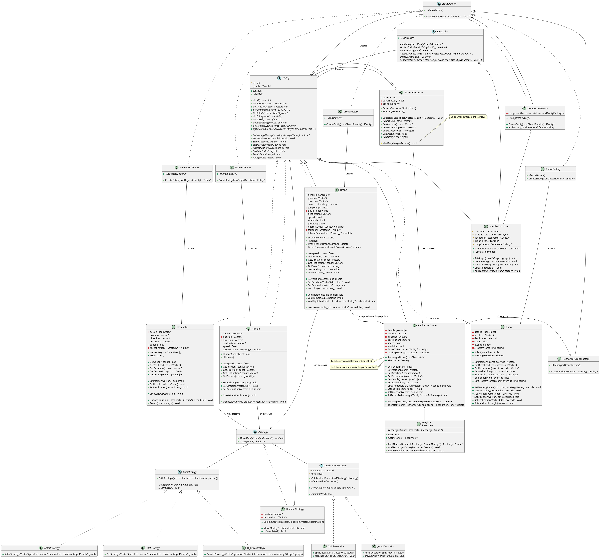

# Write up

## Team information
**Team-001-36**  
Stephen Ma, ma000094  
Robert Wang, wan00379  
Robert Tan, tan00222  
Calvin Theis, theis530

## Youtube Presentation Link
https://www.youtube.com/watch?v=dQw4w9WgXcQ&ab_channel=RickAstley

## Docker Hub Link


## Project Overview
This project is a drone simulation system that takes place on the University of Minnesota campus. The user is able to schedule trips by setting the pickup location and final destination of a robot. A drone will then pick up the robot and bring it to its destination. Each drone also has a battery life that is decremented over the course of the simulation. When the drone runs out of battery, a special recharger drone will fly to the drone and charge its battery back up to 100%. Lastly, the user can also collect information on all completed trips in the simulation by pressing a button that outputs a CSV file.

## How to Run the Simulation

### Git: 
In order to run the simulation, first git clone this repository. Then, cd into the project directory.  
In order to build the project, type ```make -j``` in the terminal. To run the project, type ```./build/bin/transit_service 8081 apps/transit_service/web/``` in the terminal.  

Navigate to http://127.0.0.1:8081 and you should see a visualization.  
Navigate to http://127.0.0.1:8081/schedule.html and you should see a page to schedule the trips.  
*Note: 8081 will depends on what port you used. If you use port 8082, then it will be http://127.0.0.1:8082 instead.*

### Docker:
(note this needs to be checked)
This is the Dockerhub link: https://hub.docker.com/repository/docker/stephen3m/homework_4/general.
Pull the docker image with ```docker pull <image_name>```
Next, run the image with ```docker run --rm -it -p <local_port>:<container_port> <image_name>```
From there, you are free to navigate to the website links listed above in the Git section.

## What the Simulation Does
When the user schedules a trip for the drone to pick up and bring a robot to a specified destination, they will also choose the routing algorithm that will be used by the drone to reach that location (E.g. A*, Depth first search, Dijkstra's). Once the trip has been successfully scheduled, the nearest available (not already assigned to a robot) drone will be assigned to the newly created robot and will start flying directly towards it. Then, the drone will navigate to the final destination using the chosen routing algorithm. Because the drone's battery is constantly decremented throughout the simulation, the drone may run out of battery and stop moving in the middle of a trip. When this occurs, the closest available (not already assigned to recharging a drone) recharger drone will head directly to the dead drone. Once the recharger drone reaches the dead drone, the drone will immediately resume movement after being fully recharged by the recharger drone. After the drone reaches the final destination and drops off the robot, the drone then becomes available for the next trip. For each completed trip, the drone that completed it will collect data pertaining to battery usage, distance traveled, routing algorithm, etc. This information is saved and made readily available for outputting and analyzing.

## New Features
### Feature 1: Battery and Recharger Drones

#### What does it do?
Our first extension uses the Decorator, Mediator, and Singleton design patterns in order to attach battery functionalities to drones and to integrate properly-working recharger drones into the simulation. During the simulation, a drone's battery will constantly be draining (twice as much when the drone is moving in comparison to when it's idle). When the battery falls below or to 0%, the drone calls the mediator (Reservice). The mediator then searches for the closest, available recharger drone and calls it to start heading over to the dead drone in order to recharge it. Once the drone is recharged to 100%, it will begin moving again.

#### Why is it significantly interesting?
This feature creates a more realistic simulation as drones cannot have infinite battery life in real life. We can simulate the performance of different battery lives and observe how much time is sacrificed as a result of including recharge time. 

#### How does it add to the existing work?
All drones now have a battery decorator that wraps around the actual drone entity. The battery decorator applies battery logic and functionalities to the drone. Now, when the update function is called on the drone that is wrapped by a battery decorator, the value associated with the battery variable will be decreased each update cycle. Once the battery runs out (<= 0%), the drone will no longer keep moving. The mediator (Reservice) will be called to find the nearest, available recharger drone. Once found, the recharger drone beelines towards the dead drone and charges it every update cycle until the drone's battery reaches 100%.

#### Which design patterns are implemented and why?
The decorator pattern is used to give all transportation drones a battery. The decorator deals with all battery functionalities and logic while keeping the drone's update function intact. This is useful because all battery-related behavior is adjusted in the battery decorator without affecting the base drone's update function. In addition, if you wanted to run the simulation with drones that don't have battery lives, it is easy to do so: In the DroneFactory.cc file, all you need to do is to remove the BatteryDecorator wrapper.

The mediator and singleton patterns are used when creating Reservice. This class functions as the intermediary between drones and recharger drones; it is responsible for finding the nearest, available recharger drone when a drone has run out of battery. The mediator design pattern reduces the amount of dependencies between Drone and RechargerDrone, making it easier to modify or extend these classes in the future. Furthermore, the singleton design pattern ensures that only one mediator exists at a time, so no conflicts arise when a dead drone calls the mediator to find the closest, available recharger drone.

#### How to use the new feature
This battery feature is not able to be interacted at all by the user directly. It automatically operates as drones move throughout the simulation. However, users have the option to add recharger drones by pressing a button on the scheduling webpage.

### Feature 2: Data Collection

#### What does it do?
Our second extension uses the Singleton design pattern in the creation of a Data Collection class. Through this class, we are able to store data on each successfully completed trip made by the drones. Trip-specific statistics such as distance traveled, routing algorithm used, and amount of battery used, etc. can be outputted as a CSV file on the scheduling webpage by clicking the ```Output CSV File``` button.

#### Why is it significantly interesting?
With data collected on this simulation, analyses can be made and trends can be observed. More specifically, by experimenting with different combinations of battery lives, battery depletion rates, routing algorithms, and more, we can garner information on how to optimize drone trips. Additionally, by graphing the output csv file, we can graph the data into a more user friendly form which should allow for more easy analysis on the patterns and trends.

#### How does it add to the existing work?
Each drone entity has access to the single Data Collection instance. In addition, each drone entity now has a TripData object pointer to store data on each individual trip (E.g. distance traveled, routing algorithm used, amount of battery used). After a trip has been completed, the information stored through the TripData pointer is passed to and stored in the Data Collection instance. Lastly, there is a button on the scheduling webpage that allows the user to output the information stored by the DataCollection instance as a CSV file. Outside of the simulation, the data can also be graphed using third party software and then analyzed to determine what sort of trends, optimizations, and data is contained inside the csv file.  

#### Which design patterns are implemented and why?
The singleton pattern is used to provide all drones with a global access point to one single Data Collection instance. It protects the Data Collection instance from being overwritten elsewhere. Thus, this ensures that all information is collected in one place.  

#### How to use the new feature
The user can access the data collected throughout the simulation by pressing the ```Output CSV File``` button on the scheduling webpage. This button sends an api command to call the outputCSV function in the DataCollection class which then creates a CSV file in a folder for the user to analyze. The data collection functionaility itself is being updated behind the scenes after each trip and drone in the simulation, and so will change with each instance of the simulation.

## Sprint Retrospective
During our last sprint, several things went well. Firstly, everyone played their part in pushing progress forward. If someone was assigned to complete a task, they would do so in a timely manner. Efficiency was further supported by a planning Google Docs where an overarching to-do list was created, code logic was included, and important notes were made. The planning Google Docs also served as a platform for fleshing out ideas and discussing necessary changes. While some discussion was facilitated through the Google Docs, communication was also made through a group chat. This allowed team members to notify others on the progress they made and what else needed to be done. Furthermore, constant communication between team members allowed code to be double or even triple checked before being pushed to the main branch. Lastly, Robert Wang and Stephen Ma implemented extreme programming during lab sections. This proved to be effective since they could catch mistakes more easily and discuss ideas while coding.  

While these were all notable things that went well, there were some things that hindered team efficiency and prevented team members from working at their full potential. Although our extension ideas seemed to be fine at the beginning, we soon realized that they required more refinement. We spent two lab sections talking to T.A.’s in order to come to a final conclusion on how to best implement our extensions. Afterwards, we encountered another roadblock: There were nuances and small details in each extension that had to be figured out before we could assign team members with tasks. The specifics of what needed to be done in order to achieve two fully-working extensions required at least 1.5 weeks to be fully fleshed out. As a result, little progress was being made towards the implementation of our extensions. However, after having sufficient information on the planning Google Docs, progress was quickly made. We focused on completing one extension and then moved on to the next. While the first extension was being worked on, one group member was also working on implementing the basics of the second extension. This made it so after the first extension was completed, the changes needed to link the two extensions together was simpler.  

To improve our progress in the future, we can use Jira more in order to clearly define task assignments and responsibilities.  

## UML Diagrams for extensions

### Data Collection


### Battery, Recharger Drones, and Reservice

